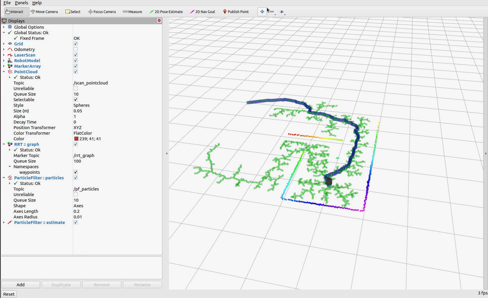

## Overview
This project demonstrates a multi-robot system where two robots collaborate using data sharing to optimize their behavior. One robot performs SLAM (Simultaneous Localization and Mapping) to explore the environment, generating a 3D world file. This file is converted into a 2D JSON map, which the second robot uses to plan an optimized path through a maze. The second robot relies entirely on the shared map data and an RRT (Rapidly-Exploring Random Tree) algorithm, eliminating the need for active object detection. The project integrates robotic platforms such as SLAM and RRT algorithm implementations.




## Platform
The project was developed using the TurtleBot3 platform and the Robot Operating System (ROS) framework. The simulation was performed using Gazebo and RViz for visualizing the published topics and robot behavior

### Packages:

- Turtlebot3 ```slam_toolbox``` 
- ROS Navigation ```move_base```

## System Architecture Description
Our project’s system architecture involves two Turtlebot robots, each performing specialized tasks. The architecture is divided into two primary components: SLAM and Exploration and Map Processing and Path Planning.
#### SLAM and Exploration:
This component leverages the Turtlebot slam_toolbox to perform Simultaneous Localization and Mapping (SLAM) while using ROS navigation nodes to explore the environment.
A Python script, ```explore.py```, implements random dispersion sampling to determine navigation points. These points along with a boundary obstacle are dynamically published as goals to the ```/map``` topic. The script uses Manhattan distance to prioritize unexplored points and updates goals accordingly with tolerance as the robot navigates. This ensures complete map coverage.
#### Map Processing and Path Planning:
After completing the exploration phase, the SLAM-generated map is exported and a Python script converts the map data into a ```.json``` format. Using a Rapidly-Exploring Random Tree (RRT) algorithm, the shortest path to the target destination is computed.


## How to Run
#### Step 1: Launch sim world 
```$ roslaunch SlamRobotFollower slam_sim.launch```

#### Step 2: Run explore script
```$ rosrun SlamRobotFollower explore.py ```

#### Step 3: Save world

#### Step 4: Process map
```$ python3 conversion.py```


```$ python3 visualize.py```

#### Step 5: Launch w
```$ roslaunch turtlebot3_bringup turtlebot3_robot.launch ```

### Step 6: Execute RRT and cmd_vel to robot
```$ rosrun SlamRobotFollower lab10_map.py```


## Authors
* Kip Gorey | [cgorey@usc.edu](mailto:cgorey@usc.edu) | [kipgorey](https://github.com/kipgorey)
* Sherman Yan | [shermany@usc.edu](mailto:shermany@usc.edu) | [shermanyan](https://github.com/shermanyan)
* Mikael Yikum | [yikum@usc.edu](mailto:yikum@usc.edu) | [YikumMikael](https://github.com/YikumMikael)


